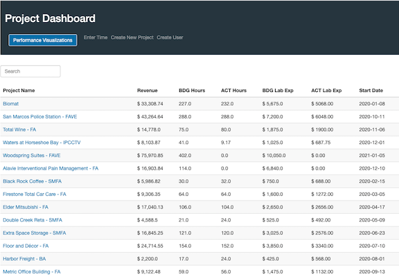
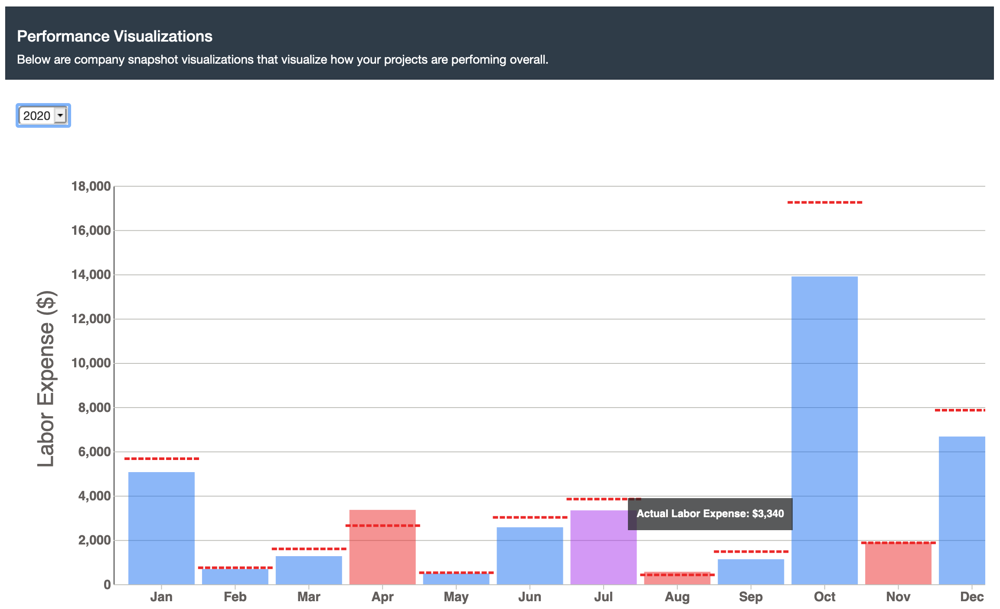
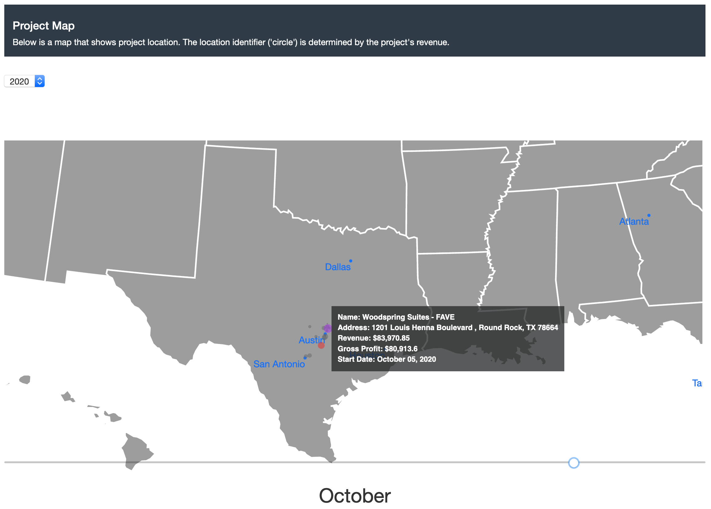
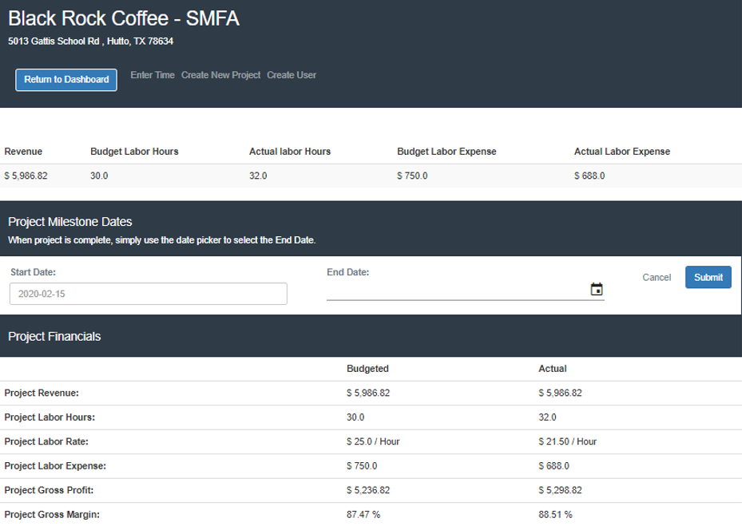
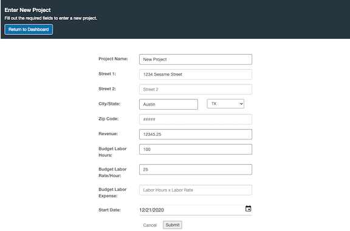
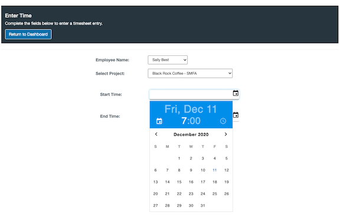
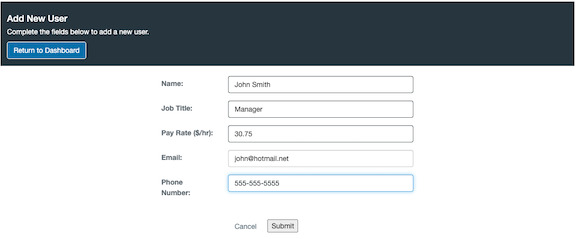
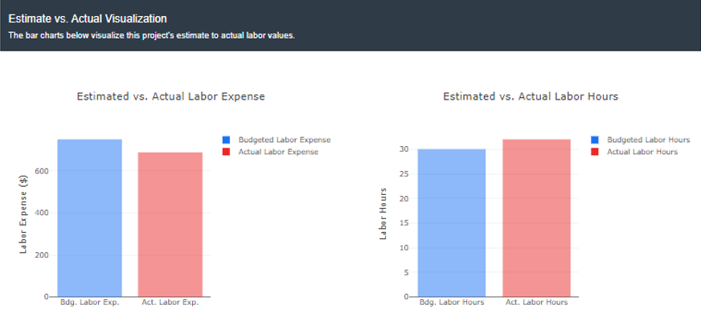

##### Data Analysis & Visualization Bootcamp, UT-Austin, 26 Januayr 2021
##### Team Members: Julie Gandre, Karen Kitchens, Michael Donatucci, Stephen Lyssy

<a href="https://job-costing-2-0.herokuapp.com/">Deployed Link</a>

# Job Costing App 2.0

## Table of contents:
* [General info](#general-info)
* [App Updates](#app-updates)
* [App Workflow](#app-workflow)
* [Screenshots](#screenshots)
* [App Routes](#app-routes)
* [Technologies](#technologies)
* [Limitations](#limitations)
* [Future Improvements](#future-improvements)

## General info:
Smaller Construction management teams have less resources and time now than they have ever had before. Other than managing the team and projects, they need to focus on the financial timelines, discussing projects with Stakeholders and runnint their day to day business. Often times, they get so busy making sure a project is done on time and making sure their bills are paid, they never even know how successful a project was or wasn't. The Job Costing App 2. will make user experience with project management tools friendlier, and allows them to give live updates to their customers, clients, and bosses all while allowing them to clearly track all expenses associated with their projects.

This app will allow for the leads to see progress in the financial and day to day workload by tracking and visualizing budgeted labor expenses, material expenses, miscellaneous expenses and subcontractor expneses, and comparing them to the actual values. This limits the back and forth of chasing employees around for timesheets and daily progress and trying to remember what expenses were actually associated with the project. Knowing when a project is exceeding budgeted expenses is often the first step to preventing a project from becoming a major loss.

## App Updates:
* Hashed Password have been add for App Authentication.
* All Plotly visualizations have been updated to D3 Visualizations allowing for more custimizations.
* A project map has been added to track project locations for the years and months. This visualization allows the user to see where there projects are located and how big or small they are in relation to other projects they have been awarded.
* Additional expense tracking has been added to allow the usere to get a better understanding of how their project is performing. These expenses include material expense, miscellaneous expense, subcontractor expense and overhead expense.

- New user page to include log-in name and password.
    - Password is hashed before saving to database.
- Home (logIndex) page includes log-in authentication.
    - Verifies hashed password. 
- Update user page (and route) added. 

## App Workflow:

## Screenshots:

 
 

## App Routes: 
* Homepage
    @app.route("/", methods=['GET'])
* Project dashboard
    @app.route("/dashboard", methods=['GET'])
* Individual project details
    @app.route("/search", methods=['GET', 'POST'])
* Enter a new project
    @app.route("/new_project", methods=['GET', 'POST'])
* Enter a new user
    @app.route("/new_user", methods=['GET', 'POST'])
* Enter a new time sheet
    @app.route("/new_time", methods=['GET', 'POST'])    

## Technologies:
* Python 
* Flask
* Psycopg2
* SQL Alchemy
* PostgresSQL
* JavaScript & D3
* HTML & CSS
* Jinja
* Bootstrap
* Heroku

## Limitations:
* App performance
* App navigation
* No options yet to delete data from the database
* No way to track vendors to vaildate expenses

## Future Improvements:
* Routes for updating and deleting data.
* Status updates and percentage complete for each project.
* Database expansion to include additional expenses for projects such as: sales tax, labor burden, and overtime.
* Features that would make this a full project management app: pdf document storage, time sheet tracking, change order tracking, and the ability for customers, subcontractors, and venders to access the app.
* Vendor tracking page that would allow the user to further categorize their expenses and easily pay their bills 

## Sources
TopoJSON is linked from Bill Morris's Github ( Block fc92e9f0a955bc418a0210be721741bd): https://gist.githubusercontent.com/mbostock/4090846/raw/d534aba169207548a8a3d670c9c2cc719ff05c47/us.json 
 
City CSV Comes from https://simplemaps.com/data/us-cities
 
D3 map slider point filtering is based on code found here: http://duspviz.mit.edu/d3-workshop/mapping-data-with-d3/